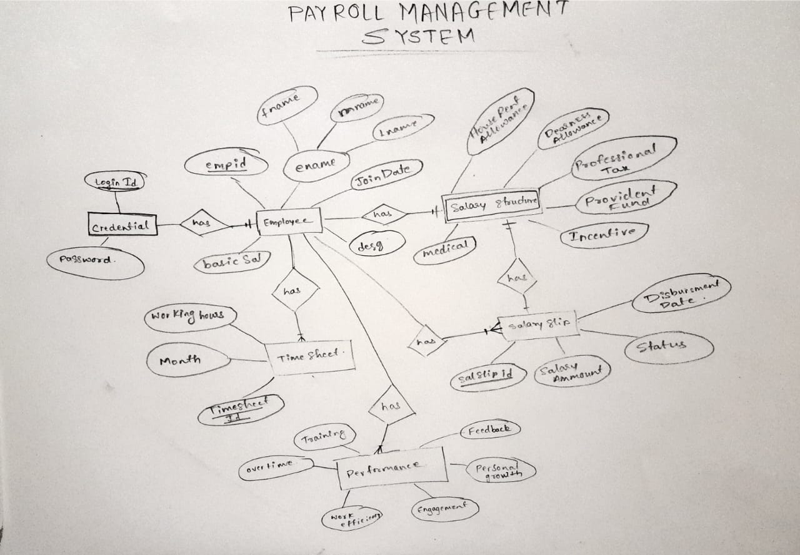

Payroll Design

Abstraction:

- Payroll portal for employees, users, HR,Borad of Directors (BOD)
- Salary Tracking by Employees
- Monitoring Operations by Operations Team(HR Team)
- Business Intelligence Dashboard for BOD

Encapusulation:

- Application users will interact with Payroll application using Portal (WebSite).
- The User Interface will invoke operation logic from remote web services.
- Business logic will be encapsulated in web services which are hosted on web server.
- Result set will be generated from database after a query is processed by database when business logic invokes business data.
- Database will perform DML,SQL, Stored Procedure Execution at database server level and hide internal implementation.

Polmorphsim & Inheritance:
- Business objects will be defined using class hierarchy user, employee, director.

Modularity:
   - Authenticatio
   - Authorization
   - PaymentProcessing
   - Business Intelligence
	
	

Concurrency:
   - All payroll Operations are under execution parallely by users, employees, BOD.

Persistence:
   - All business data will be stored in Data Store for future work
	

DFD: Data Flow Diagrams

- process: Employee data 
- external entity: Manager
- data Store: Employee timesheet

- process: Salary Disbursement
- external entity: HR
- data Store: Disbursement Status

- process: Salary Status Record
- external entity: Employee
- data Store: Disbursement Status

	
- ER Diagram : 
